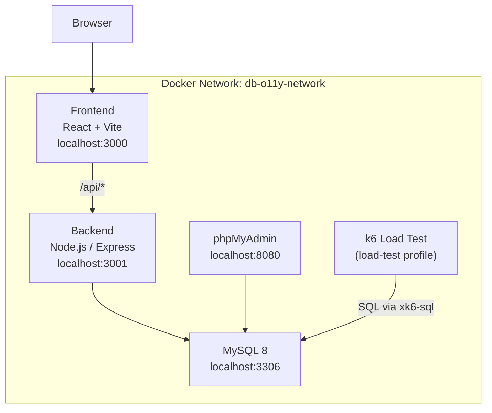

# MySQL React App Demo

A full-stack demo app running MySQL 8, a Node.js/Express backend, and a React frontend — all orchestrated with Docker Compose. Includes a k6 load test for generating realistic MySQL workloads.

---

## Architecture



---

## Prerequisites

- [Docker](https://docs.docker.com/get-docker/) and Docker Compose v2+

---

## Setup

### 1. Create the `.env` file

The `.env` file lives in the **parent directory** (`mysql-react-app-demo/`), not inside `mysql/`.

```bash
cd mysql-react-app-demo   # project root
cat > .env <<'EOF'
# MySQL
MYSQL_ROOT_PASSWORD=rootpass
MYSQL_DATABASE=super_awesome_application
MYSQL_USER=appuser
MYSQL_PASSWORD=appuserpass

# k6 load test (only needed if running the load-test profile)
K6_CLOUD_TOKEN=
K6_CLOUD_PROJECT_ID=
K6_CLOUD_STACK_ID=
K6_MYSQL_DATABASE=super_awesome_application
K6_MYSQL_USER=k6user
K6_MYSQL_PASSWORD=k6userpass
EOF
```

### 2. Start the stack

```bash
cd mysql
docker compose --env-file ../.env up -d
```

This starts four services: `mysql`, `phpmyadmin`, `backend`, and `frontend`.

### 3. Verify everything is running

```bash
docker compose --env-file ../.env ps
```

---

## Access Points

| Service     | URL                        | Notes                          |
|-------------|----------------------------|--------------------------------|
| Frontend    | http://localhost:3000      | React app — insert/query data  |
| Backend API | http://localhost:3001/api  | Express REST API               |
| phpMyAdmin  | http://localhost:8080      | MySQL web UI (login: root)     |
| MySQL       | localhost:3306             | Direct DB access               |

---

## API Endpoints

| Method | Path                      | Description                     |
|--------|---------------------------|---------------------------------|
| GET    | `/api/health`             | Health check                    |
| GET    | `/api/companies`          | List all companies              |
| POST   | `/api/companies`          | Create company `{ name }`       |
| DELETE | `/api/companies/:id`      | Delete company by ID            |
| GET    | `/api/employees`          | List all employees              |
| GET    | `/api/employees/with-company` | Employees with company name |
| POST   | `/api/employees`          | Create employee `{ name, company_id, salary }` |
| DELETE | `/api/employees/:id`      | Delete employee by ID           |

---

## Running the k6 Load Test

The k6 service is gated behind the `load-test` profile so it doesn't start automatically.

```bash
# Requires K6_CLOUD_* vars in ../.env
docker compose --env-file ../.env run --rm k6
```

The script (`scripts/mysql-loadgen-with-gck6.js`) runs a 1-hour test with:
- **60%** SELECT queries (simple, JOIN, aggregation, subquery patterns)
- **15%** INSERT, **15%** UPDATE, **10%** DELETE
- VUs ramping from 10 → 50 → 10

Results are saved to `results/k6-output.log`.

---

## Stopping the Stack

```bash
# Stop containers
docker compose --env-file ../.env down

# Stop and delete all data volumes
docker compose --env-file ../.env down -v
```

---

## File Structure

```
mysql-react-app-demo/
├── .env                        # Credentials (not committed)
└── mysql/
    ├── compose.yaml            # Docker Compose config
    ├── my.cnf                  # MySQL 8 config (Performance Schema enabled)
    ├── mysql-init/
    │   ├── 01-create-table.sql # Schema + sample data (companies, employees)
    │   └── 02-create-user.sql  # Monitoring user + grants
    ├── app/
    │   ├── backend/            # Express.js API
    │   └── frontend/           # React + Vite SPA
    ├── scripts/
    │   └── mysql-loadgen-with-gck6.js  # k6 load test script
    └── README.md
```

---

## Troubleshooting

**Services not starting** — check logs:
```bash
docker compose --env-file ../.env logs -f
```

**Backend can't reach MySQL** — MySQL takes ~30s to initialize on first run. The backend depends on the MySQL healthcheck, so it will retry automatically.

**phpMyAdmin login** — use host `mysql`, username `root`, password from `MYSQL_ROOT_PASSWORD`.

**Reset everything**:
```bash
docker compose --env-file ../.env down -v
docker compose --env-file ../.env up -d
```
