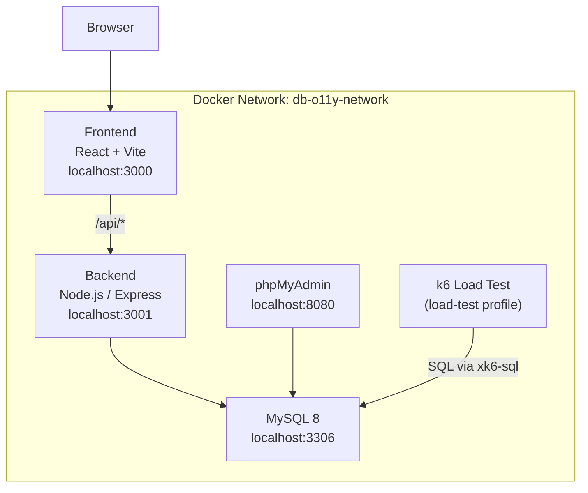

# MySQL React App Demo

A full-stack demo app running MySQL 8, a Node.js/Express backend, and a React frontend — all orchestrated with Docker Compose. Includes a k6 load test for generating realistic MySQL workloads.

> **Go from zero to fully observable in one command.**
> Use the `/gcx-observability` skill in [gcx](https://github.com/grafana/gcx), the Grafana Cloud CLI, to automatically wire up OpenTelemetry tracing, Prometheus metrics, Loki logs, Faro frontend RUM, synthetic checks, SLOs, and alert rules for this stack.

---

## Architecture




---

## Prerequisites

- [Docker](https://docs.docker.com/get-docker/) and Docker Compose v2+

---

## Setup

### 1. Clone the repository

```bash
git clone git@github.com:wcall/mysql-react-app-demo.git
cd mysql-react-app-demo
```

### 2. Create the `.env` file

The `.env` file lives in the **parent directory** (`mysql-react-app-demo/`), not inside `mysql/`.

```bash
cp .env.example .env
```

Then fill in the values for your environment. Key variables:


| Variable                              | Description                                                                  |
| ------------------------------------- | ---------------------------------------------------------------------------- |
| `MYSQL_ROOT_PASSWORD`                 | MySQL root password                                                          |
| `MYSQL_DATABASE`                      | Database name                                                                |
| `MYSQL_USER` / `MYSQL_PASSWORD`       | App DB user credentials                                                      |
| `GRAFANA_CLOUD_API_KEY`               | Cloud Access Policy token with `metrics:write`, `logs:write`, `traces:write` |
| `GCLOUD_PROMETHEUS_URL` / `_USERNAME` | Hosted Prometheus remote write URL and instance ID                           |
| `GCLOUD_LOKI_URL` / `_USERNAME`       | Hosted Loki push URL and instance ID                                         |
| `GCLOUD_TEMPO_ENDPOINT` / `_USERNAME` | Tempo OTLP endpoint (`host:port`) and instance ID                            |
| `VITE_FARO_APP_KEY`                   | Faro app key (Grafana Cloud → Frontend → Apps)                               |
| `VITE_FARO_ENDPOINT`                  | Faro collector URL                                                           |


> Grafana Cloud credentials: **Connections → Hosted Prometheus / Loki / Tempo → Details**. Use one token for all three write scopes.

### 3. Start the stack

```bash
cd mysql
docker compose --env-file ../.env up -d
```

This starts four services: `mysql`, `phpmyadmin`, `backend`, and `frontend`.

### 4. Verify everything is running

```bash
docker compose --env-file ../.env ps
```

---

## Access Points


| Service     | URL                                                    | Notes                         |
| ----------- | ------------------------------------------------------ | ----------------------------- |
| Frontend    | [http://localhost:3000](http://localhost:3000)         | React app — insert/query data |
| Backend API | [http://localhost:3001/api](http://localhost:3001/api) | Express REST API              |
| phpMyAdmin  | [http://localhost:8080](http://localhost:8080)         | MySQL web UI (login: root)    |
| MySQL       | localhost:3306                                         | Direct DB access              |


---

## API Endpoints


| Method | Path                          | Description                                    |
| ------ | ----------------------------- | ---------------------------------------------- |
| GET    | `/api/health`                 | Health check                                   |
| GET    | `/api/companies`              | List all companies                             |
| POST   | `/api/companies`              | Create company `{ name }`                      |
| DELETE | `/api/companies/:id`          | Delete company by ID                           |
| GET    | `/api/employees`              | List all employees                             |
| GET    | `/api/employees/with-company` | Employees with company name                    |
| POST   | `/api/employees`              | Create employee `{ name, company_id, salary }` |
| DELETE | `/api/employees/:id`          | Delete employee by ID                          |


---

## Running the k6 Load Test

The k6 service is gated behind the `load-test` profile so it doesn't start automatically.

```bash
# Requires K6_CLOUD_* vars in ../.env
docker compose --env-file ../.env run --rm k6
```

The script (`scripts/mysql-loadgen-with-gck6.js`) runs a 1-hour test with:

- **60%** SELECT queries (simple, JOIN, aggregation, subquery patterns)
- **15%** INSERT, **15%** UPDATE, **10%** DELETE
- VUs ramping from 10 → 50 → 10

Results are saved to `results/k6-output.log`.

---

## Stopping the Stack

```bash
# Stop containers
docker compose --env-file ../.env down

# Stop and delete all data volumes
docker compose --env-file ../.env down -v
```

---

## File Structure

```
mysql-react-app-demo/
├── .env                        # Credentials (not committed)
├── .env.example                # Environment variable template
├── README.md                   # This file
└── mysql/
    ├── compose.yaml            # Docker Compose config
    ├── my.cnf                  # MySQL 8 config (Performance Schema enabled)
    ├── mysql-init/
    │   ├── 01-create-table.sql # Schema + sample data (companies, employees)
    │   └── 02-create-user.sql  # Monitoring user + grants
    ├── app/
    │   ├── backend/            # Express.js API
    │   └── frontend/           # React + Vite SPA
    └── scripts/
        └── mysql-loadgen-with-gck6.js  # k6 load test script
```

---

## Observability with gcx

[gcx](https://github.com/grafana/gcx) is the Grafana Cloud CLI. It automates observability setup end-to-end — SLOs, synthetic checks, k6 load tests, alerting, IRM, and dashboards — using the `/gcx-observability` skill inside Claude Code.

### 1. Install gcx

Refer to the [gcx installation instructions](https://github.com/grafana/gcx) for your OS, then verify:

```bash
gcx --version
```

### 2. Configure a context

Refer to the [gcx quick start](https://github.com/grafana/gcx) for full instructions. If you're using Claude Code, the `/setup-gcx` skill walks you through it interactively:

```
/setup-gcx
```

This creates a `my-grafana` context pointing at your Grafana Cloud stack.

### 3. Verify your configuration

```bash
gcx config list-contexts
gcx config use-context my-grafana
gcx config check
gcx config view
gcx config current-context
```

### 4. Authenticate

```bash
gcx auth login --context my-grafana
```

### 5. Install the gcx plugin for Claude Code

The following steps require [Claude Code](https://github.com/anthropics/claude-code).

Add the gcx marketplace plugin, then install the gcx skill pack:

```
/plugin marketplace add grafana/gcx
```

```
/plugin install gcx@gcx-marketplace
```

### 6. Explore available skills

Ask Claude Code what skills are available from gcx:

```
What skills do I have installed from gcx?
```

To see the observability setup phases:

```
What are the phases in /gcx-observability?
```

### 7. Run the observability skill

From the `mysql/` directory of this project, tell Claude Code:

```
Run /gcx-observability phases 0-7.
```

This runs Phases 0–7: bootstrap, discovery, test definitions, instrumentation, SLO-based alerting, synthetic monitoring, k6 load testing, and IRM setup.

---

## Troubleshooting

**Services not starting** — check logs:

```bash
docker compose --env-file ../.env logs -f
```

**Backend can't reach MySQL** — MySQL takes ~30s to initialize on first run. The backend depends on the MySQL healthcheck, so it will retry automatically.

**phpMyAdmin login** — use host `mysql`, username `root`, password from `MYSQL_ROOT_PASSWORD`.

**Reset everything**:

```bash
docker compose --env-file ../.env down -v
docker compose --env-file ../.env up -d
# or build with --no-cache
docker compose --env-file ../.env build --no-cache && docker compose --env-file ../.env up
```

